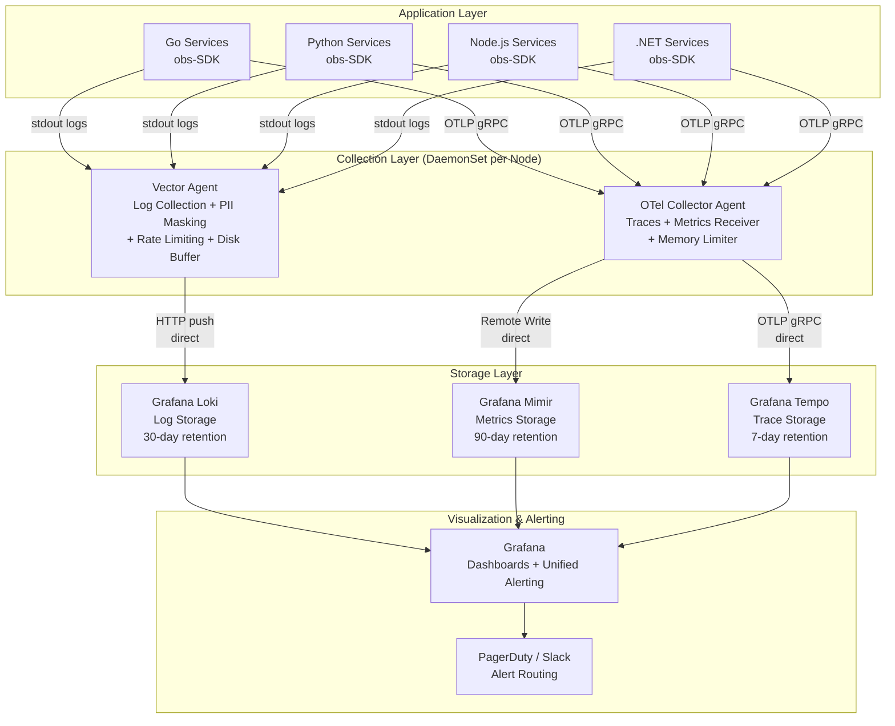
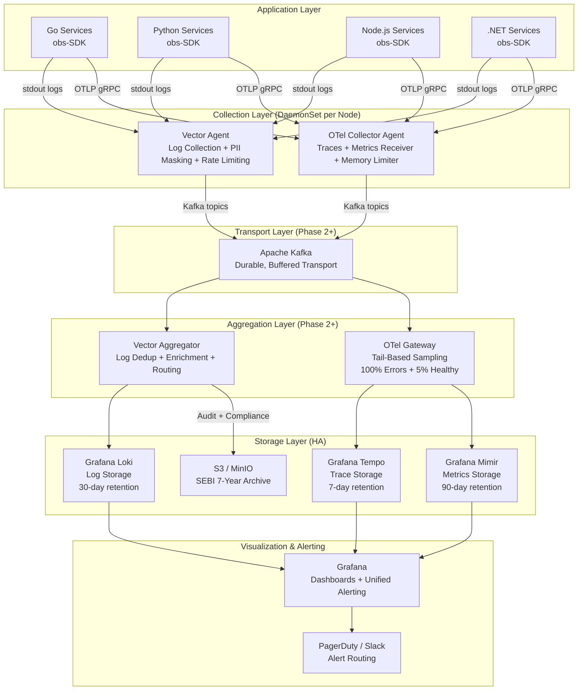
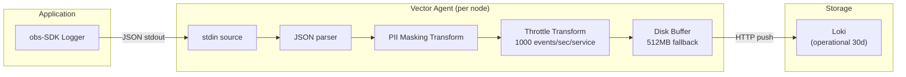
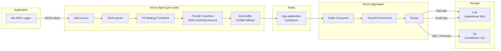
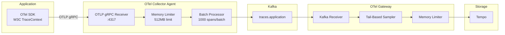
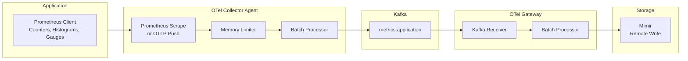
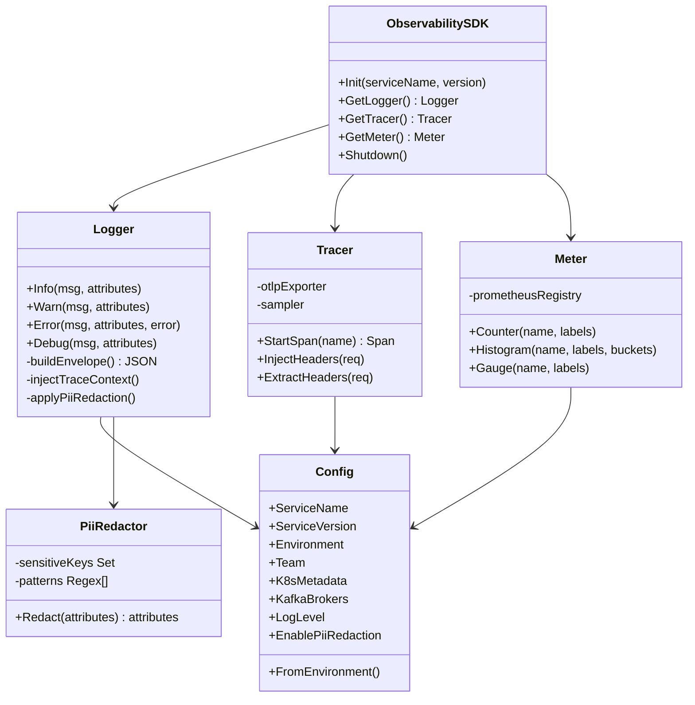
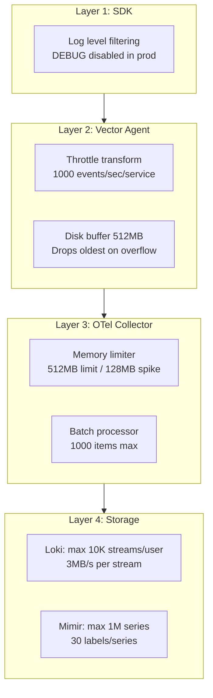
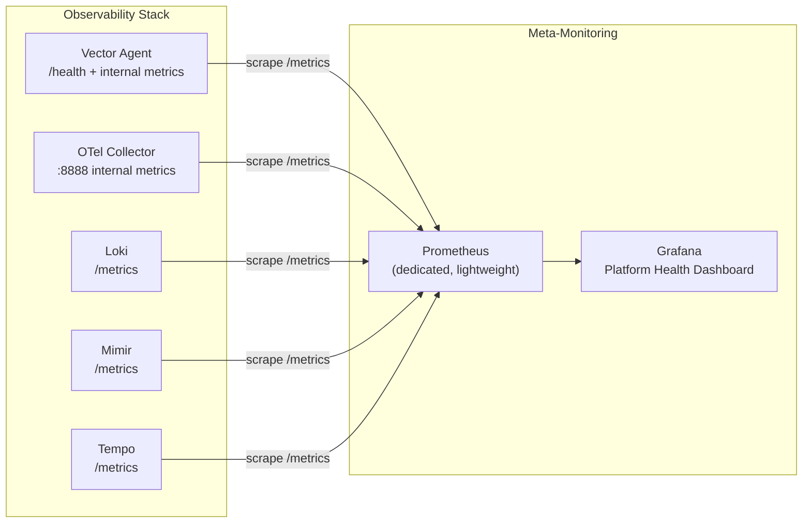
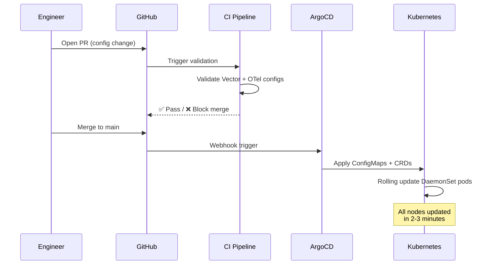

# CENTRICITY WEALTH TECH
# Platform Observability Architecture v2.0
### Full-Stack Monitoring, Alerting & Compliance

**Prepared By:** Platform Engineering Team — Avneesh, Platform Modernization
**Date:** March 2026 | **Version:** 2.0 — Final
**Classification:** CONFIDENTIAL — FOR INTERNAL USE ONLY

---

## Table of Contents

1. [Executive Summary](#1-executive-summary)
2. [Functional Requirements (FR)](#2-functional-requirements)
3. [Non-Functional Requirements (NFR)](#3-non-functional-requirements)
4. [High-Level Design (HLD)](#4-high-level-design-hld)
5. [Low-Level Design (LLD)](#5-low-level-design-lld)
6. [Technology Stack](#6-technology-stack)
7. [Platform Observability SDK](#7-platform-observability-sdk)
8. [Rate Limiting & Cardinality Protection](#8-rate-limiting--cardinality-protection)
9. [Meta-Monitoring (Observability of Observability)](#9-meta-monitoring)
10. [SEBI Compliance & Data Governance](#10-sebi-compliance--data-governance)
11. [Full Dependency Coverage](#11-full-dependency-coverage)
12. [Centralized Configuration Management](#12-centralized-configuration-management)
13. [Alerting Strategy](#13-alerting-strategy)
14. [Infrastructure Sizing & Cost](#14-infrastructure-sizing--cost)
15. [Phase-by-Phase Implementation Plan](#15-phase-by-phase-implementation-plan)
16. [Conclusion & Recommendation](#16-conclusion--recommendation)

---

## 1. Executive Summary

This document presents the **complete observability architecture** for Centricity Wealth Tech's platform modernization initiative. The proposed solution delivers full-stack visibility across all microservices and their dependencies, enabling rapid incident response, proactive performance management, and SEBI regulatory compliance.

### 1.1 The Business Problem

Centricity currently operates **10 microservices across 4 programming languages** (Go, Python, Node.js, .NET) with plans to scale to 50+ services. Without a structured observability platform:

| Risk | Impact |
|---|---|
| **MTTD** (Mean Time to Detect) is high | Teams discover problems from customer reports |
| **MTTR** (Mean Time to Resolve) is extended | Engineers spend hours correlating logs manually |
| **SEBI compliance gaps** | Audit trails for financial transactions are incomplete |
| **No unified visibility** | PostgreSQL, Redis, Kafka, NGINX are blind spots |
| **Scaling risk** | 10 → 50 services without observability = exponential debugging complexity |

### 1.2 The Proposed Solution

A **production-grade, self-hosted** observability platform built on industry-standard open-source tooling:

| Signal | Technology | Purpose |
|---|---|---|
| **Logs** | Loki + Vector | Centralized log aggregation with PII masking |
| **Metrics** | Mimir + OTel Collector | Time-series metrics for all services and dependencies |
| **Traces** | Tempo + OTel SDK | Distributed request tracing across service boundaries |
| **Alerting** | Grafana Unified Alerting | Multi-signal alerting with PagerDuty/Slack routing |
| **Control Plane** | GitOps + ArgoCD | Centralized, auditable configuration management |

### 1.3 Key Outcomes

- **MTTD reduction:** Hours → < 5 minutes via unified alerting
- **MTTR reduction:** Hours → < 30 minutes via correlated logs, metrics, traces
- **SEBI compliance:** Full audit trail with automated PII masking
- **Infrastructure cost:** ~$400/month (vs $15,000–25,000/month for SaaS)
- **Scales** from 10 to 500+ services without architectural changes

---

## 2. Functional Requirements (FR)

### 2.1 Log Collection & Aggregation

| ID | Requirement | Priority | Phase |
|---|---|---|---|
| FR-LOG-01 | All microservices (Go, Python, Node.js, .NET) SHALL emit structured JSON logs in the unified envelope format containing `timestamp`, `severity`, `severity_num`, `message`, `service`, `attributes`, and `error` blocks | P0 | 1 |
| FR-LOG-02 | The SDK SHALL auto-inject OpenTelemetry trace context (`trace_id`, `span_id`, `parent_span_id`, `trace_flags`) into every log line's `attributes` block without developer intervention | P0 | 1 |
| FR-LOG-03 | Logs SHALL be transported via Kafka (production) or direct-to-Loki (development) with configurable routing per environment | P1 | 2 |
| FR-LOG-04 | The system SHALL support three log transports: console (stdout), file, and Kafka — each independently toggleable via environment variables | P1 | 1 |
| FR-LOG-05 | Log queries SHALL be executable via Grafana → Loki with filtering by service name, severity, environment, trace_id, and time range | P0 | 1 |

### 2.2 Distributed Tracing

| ID | Requirement | Priority | Phase |
|---|---|---|---|
| FR-TRC-01 | All inter-service HTTP and gRPC calls SHALL propagate W3C TraceContext headers automatically via the SDK | P0 | 1 |
| FR-TRC-02 | Traces SHALL be exported via OTLP gRPC (primary) or OTLP HTTP/protobuf (fallback) to the OTel Collector | P0 | 1 |
| FR-TRC-03 | Tail-based sampling SHALL retain 100% of error traces, 100% of slow traces (>1s), 100% of financial service traces, and 5% of healthy traces | P1 | 2 |
| FR-TRC-04 | Grafana SHALL provide trace-to-log correlation — clicking a trace span SHALL display associated logs filtered by trace_id | P0 | 1 |

### 2.3 Metrics Collection

| ID | Requirement | Priority | Phase |
|---|---|---|---|
| FR-MET-01 | All services SHALL expose standard HTTP metrics: `http_requests_total` (counter), `http_request_duration_seconds` (histogram), `http_requests_in_flight` (gauge) | P0 | 1 |
| FR-MET-02 | Infrastructure dependency metrics SHALL be collected for PostgreSQL, Redis, Kafka, and NGINX via OTel Collector receivers | P1 | 2 |
| FR-MET-03 | Host-level metrics (CPU, memory, disk, network) SHALL be collected via OTel `hostmetrics` receiver | P1 | 1 |
| FR-MET-04 | Kubernetes cluster and pod metrics SHALL be collected via OTel `k8s_cluster` receiver | P2 | 2 |

### 2.4 PII Masking & Compliance

| ID | Requirement | Priority | Phase |
|---|---|---|---|
| FR-PII-01 | PII data (PAN, Aadhaar, card numbers, phone, email, UPI) SHALL be masked at the Vector Agent edge before leaving the host | P0 | 1 |
| FR-PII-02 | The SDK SHALL redact known sensitive field names (`password`, `token`, `api_key`, `secret`, `ssn`, `credit_card`) as a second defense layer | P0 | 1 |
| FR-PII-03 | DDL audit events (CREATE, ALTER, DROP) from PostgreSQL SHALL be captured, enriched with user identity and timestamp, and archived to S3 for 7-year SEBI retention | P1 | 2 |

### 2.5 Alerting & Notification

| ID | Requirement | Priority | Phase |
|---|---|---|---|
| FR-ALT-01 | Grafana Unified Alerting SHALL evaluate alert rules against Mimir (metrics) and Loki (logs) data sources at 1-minute intervals | P0 | 1 |
| FR-ALT-02 | Alert notifications SHALL route to PagerDuty (P0/P1) and Slack (P2/P3) with per-service contact point configuration | P0 | 1 |
| FR-ALT-03 | The system SHALL support anomaly-based alerts using 7-day baseline deviation (2–3x historical average) | P2 | 2 |

### 2.6 Dashboards & Visualization

| ID | Requirement | Priority | Phase |
|---|---|---|---|
| FR-DSH-01 | A **Service Health** dashboard SHALL display RED metrics (Rate, Errors, Duration) with P50/P95/P99 latency for all services | P0 | 1 |
| FR-DSH-02 | A **Platform Health** dashboard SHALL display health of Vector, OTel Collector, Loki, Mimir, and Tempo (meta-monitoring) | P0 | 1 |
| FR-DSH-03 | A **Database Health** dashboard SHALL display PostgreSQL connections, deadlocks, slow queries, replication lag, and table bloat | P1 | 2 |

---

## 3. Non-Functional Requirements (NFR)

### 3.1 Performance

| ID | Requirement | Target | Phase |
|---|---|---|---|
| NFR-PERF-01 | Log ingestion pipeline SHALL sustain **100,000 logs/second** without data loss under peak load | 100K logs/sec | 3 |
| NFR-PERF-02 | SDK instrumentation overhead SHALL add no more than **2ms latency** per HTTP request in application hot path | < 2ms P99 | 1 |
| NFR-PERF-03 | Grafana dashboard queries SHALL return results within **5 seconds** for the last 1 hour of data | < 5s query | 1 |
| NFR-PERF-04 | Log-to-Loki end-to-end latency (from SDK emit to queryable in Grafana) SHALL be under **30 seconds** | < 30s e2e | 1 |

### 3.2 Availability & Reliability

| ID | Requirement | Target | Phase |
|---|---|---|---|
| NFR-AVL-01 | The observability platform SHALL achieve **99.9% availability** (< 8.7 hours downtime/year) | 99.9% uptime | 3 |
| NFR-AVL-02 | Log pipeline SHALL implement **disk buffering** at Vector Agent to prevent data loss during Kafka/Loki outages (up to 512MB per node) | 0 data loss (buffered) | 1 |
| NFR-AVL-03 | Loki SHALL run in **HA mode** (SimpleScalable with S3 backend) by end of Phase 3 to eliminate single point of failure | No SPOF | 3 |
| NFR-AVL-04 | Failure in the log pipeline SHALL NOT impact trace or metric collection (signal isolation) | Independent pipelines | 1 |

### 3.3 Scalability

| ID | Requirement | Target | Phase |
|---|---|---|---|
| NFR-SCL-01 | Architecture SHALL scale from **10 to 500+ services** without structural changes | 500+ services | 4 |
| NFR-SCL-02 | New Kubernetes nodes SHALL be **fully observable within 60 seconds** of joining the cluster via DaemonSet auto-scheduling | < 60s onboarding | 1 |
| NFR-SCL-03 | Adding a new service to observability SHALL require only SDK init code — **no infrastructure changes** | Zero infra changes | 1 |

### 3.4 Security & Compliance

| ID | Requirement | Target | Phase |
|---|---|---|---|
| NFR-SEC-01 | All observability data SHALL remain within **Indian data centers** (AWS Mumbai / Azure India) — no data leaves Indian jurisdiction | SEBI data residency | 1 |
| NFR-SEC-02 | PII masking SHALL be applied **at the edge** (Vector Agent on the same node) before data transits any network | Edge masking | 1 |
| NFR-SEC-03 | DDL audit events and financial transaction logs SHALL be retained for **7 years** in immutable storage (S3/MinIO with Object Lock) | 7-year retention | 2 |
| NFR-SEC-04 | All configuration changes SHALL go through **peer-reviewed Pull Request** via GitOps — providing a full audit trail | Change audit trail | 1 |

### 3.5 Rate Limiting & Protection

| ID | Requirement | Target | Phase |
|---|---|---|---|
| NFR-RL-01 | Each layer (SDK, Vector, OTel Collector, Storage) SHALL enforce rate limits to prevent a **single misbehaving service from impacting the entire stack** | 4-layer protection | 1 |
| NFR-RL-02 | Loki SHALL enforce a maximum of **10,000 active streams per tenant** and **3 MB/s per stream** | Stream limits | 1 |
| NFR-RL-03 | Mimir SHALL enforce a maximum of **1,000,000 active series per tenant** and **30 labels per series** | Series limits | 1 |
| NFR-RL-04 | OTel Collector SHALL enforce a **512 MB memory limit** with 128 MB spike allowance to prevent OOM kills | Memory cap | 1 |

### 3.6 Operability

| ID | Requirement | Target | Phase |
|---|---|---|---|
| NFR-OPS-01 | The observability stack itself SHALL be monitored via a **dedicated meta-monitoring** layer (Prometheus scraping internal metrics) | Self-monitoring | 1 |
| NFR-OPS-02 | MTTD for production incidents SHALL be reduced to **< 5 minutes** via proactive alerting | < 5 min MTTD | 1 |
| NFR-OPS-03 | MTTR for production incidents SHALL be reduced to **< 30 minutes** via correlated logs-metrics-traces | < 30 min MTTR | 2 |

### 3.7 Cost Efficiency

| ID | Requirement | Target | Phase |
|---|---|---|---|
| NFR-COST-01 | Total infrastructure cost SHALL remain under **$700/month** for up to 30 services | < $700/mo | 2 |
| NFR-COST-02 | Cost SHALL be **< 5% of equivalent SaaS** (Datadog/New Relic) while providing comparable capabilities | 95% savings | 1 |

### 3.8 Maintainability

| ID | Requirement | Target | Phase |
|---|---|---|---|
| NFR-MNT-01 | SDK SHALL be configurable entirely via **environment variables** — no code changes required for config updates | Env-var config | 1 |
| NFR-MNT-02 | SDK SHALL provide **identical API surface** across all 4 languages (Go, Python, Node.js, .NET) to minimize cognitive load | Unified API | 1 |

---

## 4. High-Level Design (HLD)

### 4.1 Architecture Overview

The architecture follows a **layered pipeline design** that evolves across phases. **Phase 1 operates without Kafka** (direct pipelines) for simplicity and cost savings. **Kafka is introduced in Phase 2** when service count exceeds 20+ and durable buffering becomes critical.

#### Phase 1 Architecture (No Kafka — Direct Pipelines)



> **Phase 1 Rationale:** At 10 services, Kafka (3 brokers, 24 GB RAM) is the most expensive component. Vector Agent with 512 MB disk buffer provides sufficient durability for this scale. If Loki is temporarily down, Vector buffers logs to disk and retries.

#### Phase 2+ Architecture (With Kafka — Durable Pipelines)



### 2.2 Design Principles

| Principle | Implementation |
|---|---|
| **Vendor-agnostic** | No lock-in to any single vendor. All CNCF-grade open source. |
| **Data sovereignty** | All data stored within Indian infrastructure (AWS Mumbai / Azure India) |
| **Defense in depth** | PII masking at edge (Vector Agent) — data never travels unmasked |
| **GitOps-first** | All config changes are auditable, peer-reviewed, rollback-ready via ArgoCD |
| **Polyglot support** | Identical observability across Go, Python, Node.js, .NET via unified SDK |
| **Failure isolation** | Log pipeline failure does not impact trace or metric collection |
| **Auto-scales** | DaemonSet deployment — new K8s nodes are observable in < 60 seconds |
| **Rate-protected** | Every layer has backpressure and cardinality limits to prevent cascade failure |

### 2.3 Environment Strategy

| Component | Phase 1 (No Kafka) | Phase 2+ (With Kafka) |
|---|---|---|
| Log Transport | **Vector Agent → Loki direct** (disk buffer fallback) | Kafka (buffered, durable) |
| Trace Transport | **OTel Agent → Tempo direct** | OTel Agent → Kafka → OTel Gateway → Tempo |
| Metric Transport | **OTel Agent → Mimir direct** | OTel Agent → Kafka → OTel Gateway → Mimir |
| Trace Sampling | Head-based (sampling at SDK) | **Tail-based** at OTel Gateway: 5% healthy + 100% errors |
| PII Masking | Enforced at Vector Agent | Enforced at Vector Agent |
| Retention | Logs 30d, Metrics 90d, Traces 7d | Same + S3 7-year archive |
| Alert Routing | PagerDuty (P0/P1) + Slack (P2) | Same |
| Log Aggregation | None (direct ingest) | Vector Aggregator: dedup, enrich, route |
| Rate Limiting | Enforced at all layers | Enforced at all layers |
| **When to upgrade** | — | **When service count > 20 or log volume > 10K/sec** |

---

## 5. Low-Level Design (LLD)

### 5.1 Data Flow — Log Pipeline

#### Phase 1 — Direct Pipeline (No Kafka)



> **Disk buffer**: If Loki is temporarily unavailable, Vector Agent buffers up to 512 MB of logs to local disk and retries automatically. At ~1 KB/log, this holds ~500K log entries — sufficient for a 5–10 minute outage.

#### Phase 2+ — Kafka-Backed Pipeline



### 3.2 Data Flow — Trace Pipeline (Detailed)



**Tail-Based Sampling Policy:**
| Condition | Sample Rate | Rationale |
|---|---|---|
| Error spans (status ≠ OK) | **100%** | Never lose error traces |
| Slow spans (> 1 second) | **100%** | Identify performance regressions |
| Financial services (order, payment, settlement) | **100%** | SEBI audit compliance |
| Healthy, fast spans | **5%** | Cost control — reduces storage 20x |

### 3.3 Data Flow — Metrics Pipeline (Detailed)



### 3.4 Unified Log Envelope Schema

All services, regardless of language, emit logs in this exact JSON format:

```json
{
  "timestamp":    "2026-02-23T10:15:30.123456789Z",
  "severity":     "INFO",
  "severity_num": 9,
  "message":      "Order created successfully",
  "service": {
    "service.name":           "order-service",
    "service.version":        "1.4.2",
    "service.namespace":      "broking",
    "deployment.environment": "production",
    "host.name":              "node-3-pod-abc123",
    "k8s.pod.name":           "order-service-7d9f8b-xkz2p",
    "k8s.namespace.name":     "platform",
    "k8s.node.name":          "ip-10-0-1-45"
  },
  "attributes": {
    "trace_id":       "4bf92f3577b34da6a3ce929d0e0e4736",
    "span_id":        "00f067aa0ba902b7",
    "parent_span_id": "bbb222",
    "trace_flags":    "01",
    "log.type":       "app",
    "team":           "broking",
    "request_id":     "req-uuid-here",
    "http.method":    "POST",
    "http.route":     "/api/v1/orders",
    "http.status_code": 201,
    "http.duration_ms": 142,
    "request.body":   "{\"symbol\":\"RELIANCE\",\"qty\":10}",
    "user_id":        "USR-9812",
    "order_id":       "ORD-20260223-00123"
  },
  "error": {
    "message": "Connection timeout",
    "type":    "TimeoutError",
    "stack":   "at Order.process() line 42..."
  }
}
```

**Key design decisions:**
- `trace_id`, `span_id`, `parent_span_id`, `trace_flags` are **auto-injected** by the SDK from the active OTel span — callers never pass these manually
- `error` block is **only populated on error** — empty `{}` on success
- `request.body` must be **PII-redacted before logging** by the caller
- `severity_num` follows the **OTel Severity Number spec** (DEBUG=5, INFO=9, WARN=13, ERROR=17, FATAL=21)

### 3.5 SDK Architecture (Internal)



---

## 6. Technology Stack

### 4.1 Why LGTM Stack

| Stack | Industry Adoption | Resource Cost | Grafana Integration | SEBI Fit |
|---|---|---|---|---|
| **LGTM (Chosen)** | Mainstream, thousands of companies | Low | Native (same vendor) | Full self-hosted |
| ELK Stack | Legacy standard | Very High | Plugin only | Self-hosted possible |
| VictoriaMetrics | Growing, efficient | Lowest | Good | Self-hosted possible |
| Datadog SaaS | Enterprise standard | $15–25K/mo | Native | ⚠️ Data residency risk |

### 4.2 Component Versions

| Component | Version | Role |
|---|---|---|
| Grafana Loki | 3.0.0 | Log storage + querying |
| Grafana Mimir | 2.12.0 | Long-term metrics storage |
| Grafana Tempo | 2.3.0 | Distributed trace storage |
| Grafana | 10.4.0 | Visualization + alerting |
| Vector | 0.34.1 | Log collection, transformation, routing |
| OTel Collector Contrib | 0.91.0 | Trace/metric collection + dependency monitoring |
| Apache Kafka | 7.5.0 (Confluent) | Durable log/trace/metric transport |
| ArgoCD | 2.10+ | GitOps configuration management |

---

## 7. Platform Observability SDK

### 5.1 SDK Packages

| Language | Package | Logging Library | Tracing | Metrics |
|---|---|---|---|---|
| **Go** | `centricity/obs-go` | Zap + EnvelopeCore | OTel SDK (OTLP gRPC) | Prometheus client |
| **Python** | `centricity-obs` | structlog + envelope processor | OTel SDK (OTLP gRPC) | prometheus-client |
| **Node.js** | `@centricity/obs` | Custom EnvelopeLogger | OTel SDK (OTLP gRPC) | prom-client |
| **.NET** | `Centricity.Observability` | **Serilog** + EnvelopeSink | OTel SDK (OTLP) | OTel + Prometheus |

### 5.2 What the SDK Handles

- ✅ OTel SDK initialization and configuration
- ✅ OTLP exporter setup (endpoint, retry, timeout, backpressure)
- ✅ Resource attributes: `service.name`, `service.version`, `deployment.environment`, `host.name`
- ✅ W3C TraceContext propagation across HTTP and gRPC
- ✅ **Auto-injection** of `trace_id`, `span_id`, `parent_span_id`, `trace_flags` into every log
- ✅ Metric naming convention enforcement
- ✅ Structured log formatting matching the unified envelope schema
- ✅ PII redaction of sensitive fields before logging
- ✅ Console, file, and Kafka transports with fallback

### 5.3 SDK Init — One-Line Setup

```go
// Go
obs.Init("order-service", "v1.4.2")
defer obs.Shutdown()
```

```python
# Python
init_observability(service_name="order-service", version="1.4.2")
```

```typescript
// Node.js
const logger = newLogger('order-service');
const { tracer } = newTracer('order-service');
```

```csharp
// .NET (ASP.NET Core)
var logger = ObservabilityLogger.Create("order-service");
builder.Services.AddOpenTelemetry()
    .WithTracing(b => TracerFactory.Configure(b, "order-service"))
    .WithMetrics(b => MetricsFactory.Configure(b, "order-service"));
```

---

## 8. Rate Limiting & Cardinality Protection

> [!CAUTION]
> Without rate limiting and cardinality protection, a single misbehaving service can take down the entire observability stack. This is the #1 production killer.

### 6.1 Layered Protection



### 6.2 Configuration Limits

| Component | Setting | Value | Purpose |
|---|---|---|---|
| **Loki** | `max_streams_per_user` | 10,000 | Prevent cardinality explosion |
| **Loki** | `per_stream_rate_limit` | 3MB/s | Prevent single service flooding |
| **Loki** | `per_stream_rate_limit_burst` | 15MB | Allow brief spikes |
| **Loki** | `max_line_size` | 256KB | Reject oversized log lines |
| **Loki** | `max_label_names_per_series` | 15 | Prevent label bloat |
| **Mimir** | `max_global_series_per_user` | 1,000,000 | Prevent series explosion |
| **Mimir** | `max_label_names_per_series` | 30 | Prevent label bloat |
| **Mimir** | `max_fetched_series_per_query` | 50,000 | Protect query path |
| **Vector** | Throttle transform | 1,000 events/sec | Per-service rate cap |
| **Vector** | Disk buffer | 512 MB | Prevent data loss on Kafka outage |
| **OTel Collector** | `memory_limiter` | 512 MB limit | Prevent OOM |
| **OTel Collector** | Batch processor | 1,000 max per batch | Backpressure control |

---

## 9. Meta-Monitoring

> [!IMPORTANT]
> Who monitors the monitors? A dedicated meta-monitoring layer ensures the observability stack itself is healthy.

### 7.1 Meta-Monitoring Architecture



### 7.2 Platform Health Dashboard Panels

| Panel | Source | Alert Threshold |
|---|---|---|
| **Vector Agent errors** | `component_errors_total` | > 0 for 5 min → P0 |
| **Vector throughput (events/sec)** | `component_sent_events_total` | — (informational) |
| **OTel Collector dropped items** | `otelcol_processor_dropped_spans` | > 0 for 5 min → P1 |
| **OTel Collector queue size** | `otelcol_exporter_queue_size` | > 80% capacity → P1 |
| **Loki ingestion rate** | `loki_distributor_bytes_received_total` | — (informational) |
| **Loki active streams** | `loki_ingester_streams_created_total` | > 8,000 → P2 (nearing limit) |
| **Mimir active series** | `cortex_ingester_active_series` | > 800,000 → P2 (nearing limit) |
| **Tempo ingestion rate** | `tempo_distributor_spans_received_total` | — (informational) |
| **Kafka consumer lag** | `kafka_consumer_group_lag` | > 100,000 → P1 |

---

## 10. SEBI Compliance & Data Governance

### 8.1 PII Masking Strategy

All PII masking is applied at the **Vector Agent (edge)** before data leaves the host:

| Data Type | Pattern | Masked As |
|---|---|---|
| PAN Number | `AAAAA0000A` (10 char) | `[PAN_MASKED]` |
| Aadhaar Number | 12-digit number | `[AADHAAR_MASKED]` |
| Bank Account | `account_no='...'` | `account_no='[MASKED]'` |
| Credit/Debit Card | 16-digit card | `[CARD_MASKED]` |
| Phone Number | 10-digit mobile (starts 6–9) | `[PHONE_MASKED]` |
| Email Address | Standard email format | `[EMAIL_MASKED]` |
| UPI ID | `text@upi` | `[UPI_MASKED]` |

> **SDK-Level PII**: The SDK also redacts known sensitive field names (`password`, `token`, `api_key`, `secret`, `ssn`, `credit_card`, etc.) as a second line of defense.

### 8.2 Data Sovereignty

> [!IMPORTANT]
> All observability infrastructure is self-hosted within Indian data centers (AWS Mumbai / Azure India regions). No observability data leaves Indian jurisdiction. This complies with SEBI data localization requirements.

### 8.3 Audit Trail & Retention

| Data | Operational Retention | Compliance Retention | Storage |
|---|---|---|---|
| Application logs | 30 days (Loki) | 7 years (S3/MinIO Parquet) | Hot → Cold |
| DDL audit events | 90 days (Loki) | 7 years (S3/MinIO) | Hot → Cold |
| Financial traces | 7 days (Tempo) | 7 years (S3/MinIO) | Hot → Cold |
| Metrics | 90 days (Mimir) | 1 year (downsampled) | Hot → Warm |

---

## 11. Full Dependency Coverage

| Component | Metrics | Logs | Traces | Collection Method |
|---|---|---|---|---|
| **Application Services** | ✅ Full | ✅ Full | ✅ Full | obs-SDK + OTel Collector |
| **NGINX (API Gateway)** | ✅ Full | ✅ Full | — | OTel nginx receiver + Vector |
| **Apache Kafka** | ✅ Full | ✅ Full | — | OTel kafkametrics + Vector |
| **PostgreSQL** | ✅ Full | ✅ Full | ✅ Npgsql | OTel pg receiver + Vector |
| **Redis** | ✅ Full | ✅ Slowlog | — | OTel redis receiver + Vector |
| **Kubernetes Cluster** | ✅ Full | ✅ Events | — | OTel k8s_cluster receiver |
| **Infrastructure (Nodes)** | ✅ Full | ✅ System | — | OTel hostmetrics receiver |
| **Inter-service HTTP/gRPC** | ✅ Full | — | ✅ Full | Auto-instrumentation via SDK |

---

## 12. Centralized Configuration Management

### 10.1 GitOps with ArgoCD

All observability configuration is managed via **GitOps using ArgoCD**. A single Git repository is the source of truth.



### 10.2 Config Hierarchy

| Priority | Scope | Example |
|---|---|---|
| 1 (Highest) | Host override | One-off node exception (rare) |
| 2 | Role override | DB nodes get PostgreSQL parsing; payment nodes get stricter PII |
| 3 (Base) | Global base | Common sinks, standard PII masking, Loki endpoint |

### 10.3 Kubernetes Autoscale Compatibility

New K8s nodes are fully observable within **60 seconds** of joining thanks to DaemonSet deployment:
1. New node joins cluster → K8s schedules Vector + OTel DaemonSet pods
2. Pods read existing ConfigMap → correct role-specific config applied
3. No manual intervention required

---

## 13. Alerting Strategy

### 11.1 Alert Severity Levels

| Level | Response Time | Routing | Examples |
|---|---|---|---|
| **P0 — Critical** | Immediate page | PagerDuty + Slack #incidents | Service down, DB unreachable, Kafka offline |
| **P1 — High** | Within 15 min | PagerDuty + Slack #alerts | P99 latency > 2x baseline, connection pool > 80% |
| **P2 — Medium** | Next business hour | Slack #platform-alerts | Slow query regression, cache hit rate < 80% |
| **P3 — Low** | Sprint planning | Slack #observability | Unused indexes, table bloat > 20% |

### 11.2 Alert Rules

#### P0 — Page Immediately
- Error rate > 10% for 2 consecutive minutes (any service)
- PostgreSQL primary unreachable
- Kafka consumer lag > 100,000 messages
- Node disk utilization > 90%
- Pod CrashLoopBackOff detected
- Authentication failure spike (SEBI security alert)
- **Vector Agent errors > 0 for 5 minutes** *(new — meta-monitoring)*

#### P1 — High
- P99 request latency > 2 seconds for 5 minutes
- Redis memory > 80% of limit
- Database connections > 80% of max_connections
- Kafka broker offline
- SSL/TLS certificate expiry < 7 days
- **OTel Collector dropping spans/metrics** *(new — meta-monitoring)*
- **In-flight requests > 50 for any service** *(new — backpressure)*

#### Anomaly-Based Alerting
Critical metrics use **baseline deviation alerting** — alerting when a metric is 2–3x its own 7-day historical average. This eliminates false positives during legitimate load spikes.

---

## 14. Infrastructure Sizing & Cost

### 14.1 Phase 1 — No Kafka (10 Services, Direct Pipelines)

| Component | vCPU | RAM | Storage | Est. Cost/Month |
|---|---|---|---|---|
| Loki (single node) | 4 | 8 GB | 500 GB SSD | ~$120 |
| Mimir (single node) | 2 | 4 GB | 100 GB SSD | ~$60 |
| Grafana Tempo | 2 | 4 GB | 200 GB SSD | ~$80 |
| Grafana | 2 | 4 GB | 20 GB | ~$60 |
| Vector Agent (per node) | 1 | 2 GB | 512 MB disk buffer | ~$20 |
| OTel Collector Agent (per node) | 1 | 1 GB | — | ~$20 |
| Prometheus (meta-monitoring) | 0.5 | 1 GB | 10 GB | ~$10 |
| Postgres Exporter | 0.5 | 512 MB | — | ~$10 |
| **TOTAL (Phase 1)** | **~13** | **~25 GB** | **~830 GB** | **~$380/month** |

> **No Kafka, no Zookeeper, no Vector Aggregator, no OTel Gateway.** This saves ~$280/month and eliminates significant operational complexity. Vector Agent pushes logs directly to Loki; OTel Collector pushes traces/metrics directly to Tempo/Mimir.

### 14.2 Phase 2 — Add Kafka (20+ Services, Durable Pipelines)

> **When to add Kafka:** Service count exceeds 20, or sustained log volume exceeds 10,000 events/second, or you need multi-consumer patterns (e.g., Loki + S3 archival simultaneously).

| Additional Component | vCPU | RAM | Storage | Est. Cost/Month |
|---|---|---|---|---|
| Kafka (3 brokers) + Zookeeper | 8 | 26 GB | 500 GB SSD | ~$220 |
| Vector Aggregator (2 replicas) | 2 | 4 GB | — | ~$40 |
| OTel Gateway (2 replicas) | 2 | 4 GB | — | ~$40 |
| **Phase 2 TOTAL** | **~25** | **~59 GB** | **~1.3 TB** | **~$680/month** |

### 12.3 Cost Comparison

| Solution | Monthly Cost | Data Residency | Ops Overhead |
|---|---|---|---|
| **LGTM Self-Hosted** | ~$380–660 | ✅ India only | Low (1 engineer ~20%) |
| Datadog | $15,000–25,000 | ⚠️ US/EU servers | None (SaaS) |
| New Relic | $10,000–20,000 | ⚠️ US/EU servers | None (SaaS) |
| ELK Self-Hosted | $2,500–4,000 | ✅ India only | Very High |

> **5-year projected savings vs. Datadog: ₹7–12 crore.**

---

## 15. Phase-by-Phase Implementation Plan

### Phase 1 — Foundation, No Kafka (Weeks 1–4)

**Goal:** Core LGTM stack running with direct pipelines (no Kafka). First 3 services observable. Basic alerting.

| Week | Deliverable | Owner |
|---|---|---|
| **W1** | Deploy LGTM stack (Loki, Mimir, Tempo, Grafana) on K8s — **no Kafka** | Platform |
| **W1** | Deploy Vector Agent (direct → Loki) + OTel Collector (direct → Tempo/Mimir) as DaemonSets | Platform |
| **W1** | Configure rate limits: Loki stream limits, Mimir cardinality limits, Vector throttle | Platform |
| **W2** | Build obs-SDK for .NET (existing services are .NET) | Platform |
| **W2** | Onboard first 3 .NET services to obs-SDK | Platform + Service Teams |
| **W2** | Configure PostgreSQL monitoring (pg_stat_statements + Vector log parsing) | Platform |
| **W3** | Set up ArgoCD GitOps repository for observability configs | Platform |
| **W3** | Deploy 3 core Grafana dashboards: Service Health, Platform Health, DB Health | Platform |
| **W3** | Configure P0/P1 alert rules with PagerDuty routing | Platform |
| **W4** | Meta-monitoring: deploy dedicated Prometheus for Vector/OTel/Loki/Mimir health | Platform |
| **W4** | Deploy PII masking in Vector Agent, validate with test data | Platform + Compliance |
| **W4** | Documentation: runbooks for P0 alerts | Platform |

**Exit Criteria:**
- [ ] 3 services producing logs visible in Grafana → Loki
- [ ] 3 services producing traces visible in Grafana → Tempo
- [ ] HTTP metrics (rate, errors, duration) visible in Grafana → Mimir
- [ ] P0/P1 alerts firing correctly on test scenarios
- [ ] PII masking verified (PAN, Aadhaar, card numbers redacted in Loki)
- [ ] Platform Health dashboard shows all stack components healthy

---

### Phase 2 — Full Coverage + Kafka (Weeks 5–8)

**Goal:** All 10 services onboarded. **Kafka transport layer introduced** for durable buffering. Full dependency monitoring.

| Week | Deliverable | Owner |
|---|---|---|
| **W5** | Build obs-SDK for Go, Python, Node.js | Platform |
| **W5** | Onboard remaining 7 services to obs-SDK | Platform + Service Teams |
| **W6** | **Deploy Kafka + Zookeeper** for durable log/trace/metric transport | Platform |
| **W6** | **Deploy Vector Aggregator** (2 replicas) — switch Vector Agent sink from Loki-direct to Kafka | Platform |
| **W6** | **Deploy OTel Gateway** (2 replicas) with tail-based sampling — switch OTel Agent to push via Kafka | Platform |
| **W6** | Add Redis, Kafka, NGINX OTel receivers | Platform |
| **W7** | Configure SEBI audit pipeline (DDL events → S3/MinIO) | Platform + Compliance |
| **W7** | Implement anomaly-based alerting rules (baseline deviation) | Platform |
| **W7** | Add Kubernetes events monitoring | Platform |
| **W8** | Deploy inter-service call dashboards (service map from Tempo) | Platform |
| **W8** | Multi-tenancy: configure Loki + Grafana RBAC per team | Platform |

**Exit Criteria:**
- [ ] All 10 services producing logs/traces/metrics
- [ ] **Kafka transport operational** — Vector Agent → Kafka → Vector Aggregator → Loki working
- [ ] Kafka consumer lag < 1,000
- [ ] Redis, PostgreSQL, Kafka, NGINX all visible in Grafana
- [ ] DDL events archived to S3 with 7-year lifecycle policy
- [ ] Team-level Grafana folders with RBAC applied

---

### Phase 3 — Scale & Harden (Weeks 9–12)

**Goal:** Production-grade hardening, SLOs, capacity planning, team training.

| Week | Deliverable | Owner |
|---|---|---|
| **W9** | Performance test: 100K logs/sec sustained load test | Platform |
| **W9** | Loki HA: Migrate to SimpleScalable mode with S3 backend | Platform |
| **W10** | Define SLIs/SLOs for all services, implement error budgets | Platform + Service Teams |
| **W10** | Deploy SLO dashboard + burn-rate alerting | Platform |
| **W11** | Document runbooks for all P0/P1 alert scenarios | Platform |
| **W11** | Add ClickHouse for SEBI compliance reporting queries | Platform |
| **W12** | Train all service teams on observability best practices | Platform |
| **W12** | Capacity planning dashboards + cost projections | Platform |

**Exit Criteria:**
- [ ] System survives 100K logs/sec for 30 minutes without data loss
- [ ] Loki running in HA mode (no single point of failure for logs)
- [ ] SLOs defined and visible for all 10 services
- [ ] All P0/P1 runbooks documented and reviewed
- [ ] Service teams trained and self-sufficient for dashboard creation

---

### Phase 4 — Scale to 50+ (Months 4–6)

**Goal:** Architecture validated at scale, automation complete.

| Deliverable | Owner |
|---|---|
| Migrate Mimir to clustered mode (read/write/backend separation) | Platform |
| Migrate Tempo to S3-backed storage | Platform |
| Deploy alerting-as-code (alert rules in Git, deployed via ArgoCD) | Platform |
| Self-service onboarding: new service → observable in < 5 minutes | Platform |
| Cost optimization: implement metric downsampling for data > 30 days | Platform |
| Evaluate OpenTelemetry Operator for automatic SDK injection | Platform |

---

## 16. Conclusion & Recommendation

The proposed architecture provides Centricity Wealth Tech with a **production-grade, SEBI-compliant, full-stack observability platform** that:

✅ Covers all 10 current services and all dependencies (PostgreSQL, Redis, Kafka, NGINX)
✅ Scales transparently to 50+ services without architectural changes
✅ Costs ~$380–660/month vs $15,000–25,000/month for SaaS
✅ Keeps all financial data within Indian jurisdiction (SEBI compliance)
✅ Provides PII masking, DDL audit trails, and 7-year retention
✅ Uses GitOps for auditable configuration management
✅ Auto-scales with Kubernetes — new nodes observable in < 60 seconds
✅ **Rate-limited at every layer** to prevent cascade failures
✅ **Self-monitoring** — the observability stack monitors itself
✅ **Unified SDK** across Go, Python, Node.js, and .NET

> [!IMPORTANT]
> **Recommendation:** Approve Phase 1 immediately. The Platform Engineering team can have the foundational stack running within 2 weeks. The ROI is realized within the first production incident.

---

*Document prepared by Platform Engineering — Centricity Wealth Tech — March 2026*
